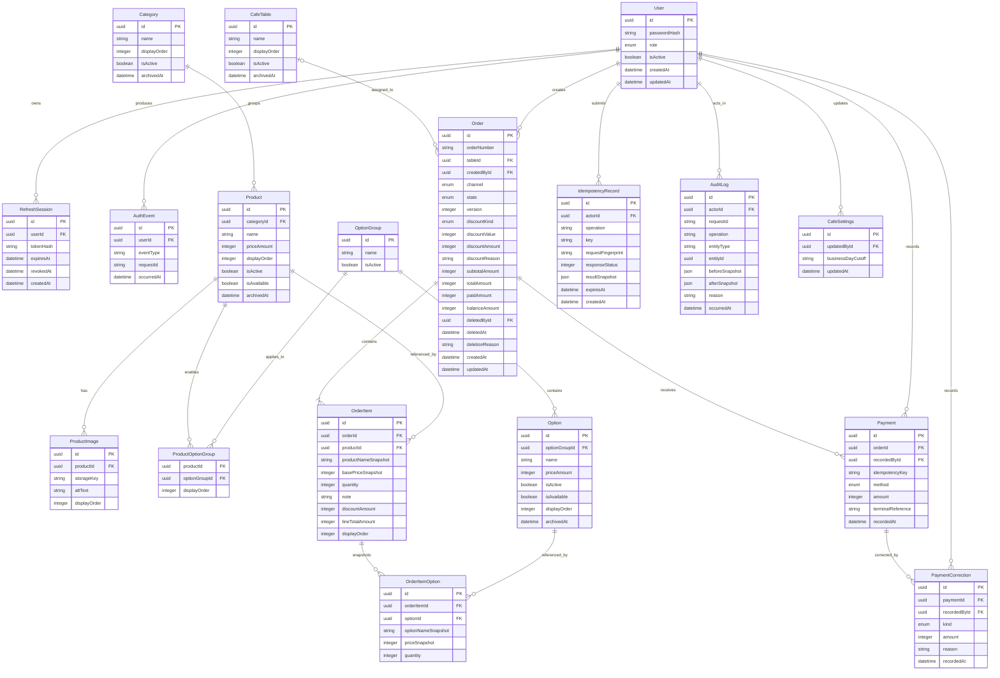

# Initial Entity Relationship Diagram

## Purpose And Status

This is the initial v1 persistence model. It translates the approved scope into
entity ownership and relationships before the Stage 1 Prisma schema and first
migration are created. It is not itself a database migration or an API contract.

All timestamps are stored in UTC. Every monetary field is an integer Toman
value. The separate database-constraint list will define the exact PostgreSQL
constraints and indexes for this model.

## Mermaid ERD

## How To Read The Diagram

An entity box represents one database table. Each line inside it is a field
(often called a column). One saved record is a row in that table: for example,
one row in `Product` represents one menu product, while one row in `OrderItem`
represents one line on one customer order.

| Diagram notation | Meaning                                                                                                                                                                                                                |
| ---------------- | ---------------------------------------------------------------------------------------------------------------------------------------------------------------------------------------------------------------------- |
| `id PK`          | **Primary key**. A stable identifier for one row. UUIDs let the application create identifiers safely without relying on a visible sequential number.                                                                  |
| `...Id FK`       | **Foreign key**. A stored link to another table's `id`, such as `Payment.orderId` linking a payment to the order it paid for. The exact referential rules are intentionally deferred to the database-constraints task. |
| `enum`           | A value chosen from a small, controlled set. Examples are the two user roles and the three order states. This prevents spelling variants from becoming data.                                                           |
| `boolean`        | A true/false value, usually for whether something can currently be used or shown.                                                                                                                                      |
| `datetime`       | A time stored in UTC. The application converts it to `Asia/Tehran` only when displaying it or calculating report boundaries.                                                                                           |
| `json`           | Structured supporting data stored as one value. Here it is limited to safe audit snapshots and idempotency response snapshots, rather than core relational data.                                                       |
| `                |                                                                                                                                                                                                                        | --o{`                                                                                                                                                                                                           | One record on the left can relate to zero or more records on the right. For example, one order contains one or more order items. |
| `o               | --o{`                                                                                                                                                                                                                  | The right-side record can have zero or one left-side record, while the left-side record can relate to many right-side records. A takeaway order therefore has no table, but a table has many historical orders. |

The ERD intentionally shows the planned business model, not the final Prisma
syntax. Whether a field is nullable, unique, indexed, or constrained is
specified in the next Stage 0 task rather than implied only by the diagram.

## Field Guide

### Identity

#### User

| Field          | Explanation                                                                                                               |
| -------------- | ------------------------------------------------------------------------------------------------------------------------- |
| `id`           | Internal identity of a Manager or Staff user. Other records use it to record who performed an action.                     |
| `passwordHash` | A one-way password hash, never the password itself. It is needed to verify sign-in securely.                              |
| `role`         | The user's controlled permission level: `MANAGER` or `STAFF`. Application authorization checks this server-side.          |
| `isActive`     | Whether this account may currently sign in and act. Deactivation preserves history instead of deleting a referenced user. |
| `createdAt`    | When the account was created.                                                                                             |
| `updatedAt`    | When an account property was most recently changed.                                                                       |

#### RefreshSession

| Field       | Explanation                                                                                                                           |
| ----------- | ------------------------------------------------------------------------------------------------------------------------------------- |
| `id`        | Internal identity of one sign-in session.                                                                                             |
| `userId`    | Link to the user who owns the session.                                                                                                |
| `tokenHash` | One-way hash of the refresh token. Storing a hash allows revocation without retaining a usable token in the database.                 |
| `expiresAt` | The latest time this session can be used to obtain a fresh access token.                                                              |
| `revokedAt` | When the session was invalidated, for logout, account deactivation, or suspected compromise. It is empty while the session is active. |
| `createdAt` | When the session was issued.                                                                                                          |

#### AuthEvent

| Field        | Explanation                                                                                                 |
| ------------ | ----------------------------------------------------------------------------------------------------------- |
| `id`         | Internal identity of an authentication event.                                                               |
| `userId`     | Link to the affected user when one is known.                                                                |
| `eventType`  | The kind of event, such as successful sign-in, failed sign-in, logout, or session revocation.               |
| `requestId`  | Correlation identifier shared with the API request logs, so an operator can investigate one request safely. |
| `occurredAt` | When the event happened.                                                                                    |

### Catalog And Preparation

#### Category

| Field          | Explanation                                                                                                           |
| -------------- | --------------------------------------------------------------------------------------------------------------------- |
| `id`           | Internal identity of a menu category.                                                                                 |
| `name`         | Staff-facing and customer-facing category name, such as `Coffee` or `Desserts`.                                       |
| `displayOrder` | The intended order when categories are shown in the menu or POS. It avoids using creation time as presentation order. |
| `isActive`     | Whether the category is currently shown for normal catalog use.                                                       |
| `archivedAt`   | When the category was retired. It remains stored when historic products reference it.                                 |

#### Product

| Field          | Explanation                                                                                                        |
| -------------- | ------------------------------------------------------------------------------------------------------------------ |
| `id`           | Internal identity of a catalog product.                                                                            |
| `categoryId`   | Link to the category used to group the product.                                                                    |
| `name`         | Current catalog name, used for current menu and POS display.                                                       |
| `priceAmount`  | Current finished customer price in integer Toman. This is not used to recalculate old orders.                      |
| `displayOrder` | Display order inside its category.                                                                                 |
| `isActive`     | Whether the product is part of the active catalog.                                                                 |
| `isAvailable`  | Temporary sellability switch. A product can stay active but be unavailable today without losing its configuration. |
| `archivedAt`   | When the product was retired. It remains available for historical traceability.                                    |

#### ProductImage

| Field          | Explanation                                                                                                                        |
| -------------- | ---------------------------------------------------------------------------------------------------------------------------------- |
| `id`           | Internal identity of one image record.                                                                                             |
| `productId`    | Link to the product the image illustrates.                                                                                         |
| `storageKey`   | The safe identifier or path used to find the file in self-hosted image storage. The database stores metadata, not the image bytes. |
| `altText`      | Text alternative for accessibility and a useful fallback when an image cannot load.                                                |
| `displayOrder` | The order of images for a product that has more than one.                                                                          |

#### OptionGroup And ProductOptionGroup

| Field                              | Explanation                                                                                                                             |
| ---------------------------------- | --------------------------------------------------------------------------------------------------------------------------------------- |
| `OptionGroup.id`                   | Internal identity of a reusable choice group, such as `Milk choice` or `Extra shots`.                                                   |
| `OptionGroup.name`                 | Current label staff and customers see for that group.                                                                                   |
| `OptionGroup.isActive`             | Whether the group can currently be selected for catalog configuration.                                                                  |
| `ProductOptionGroup.productId`     | Link to a product that permits this group.                                                                                              |
| `ProductOptionGroup.optionGroupId` | Link to the reusable group enabled for that product. This join record models a many-to-many relationship without duplicating the group. |
| `ProductOptionGroup.displayOrder`  | The order in which this choice group appears for that particular product.                                                               |

#### Option

| Field           | Explanation                                                                                              |
| --------------- | -------------------------------------------------------------------------------------------------------- |
| `id`            | Internal identity of one selectable choice within an option group.                                       |
| `optionGroupId` | Link to the group that contains this option.                                                             |
| `name`          | Current label, such as `Oat milk` or `Extra shot`.                                                       |
| `priceAmount`   | Current extra price in integer Toman. It may be zero. Historical orders use the option snapshot instead. |
| `isActive`      | Whether the option is still part of the catalog configuration.                                           |
| `isAvailable`   | Temporary availability switch for a currently active option.                                             |
| `displayOrder`  | Presentation order within the group.                                                                     |
| `archivedAt`    | When the option was retired while keeping historical references.                                         |

### Tables And Orders

#### CafeTable

| Field          | Explanation                                                                                  |
| -------------- | -------------------------------------------------------------------------------------------- |
| `id`           | Internal identity of a physical table in the one café.                                       |
| `name`         | Human-friendly table label, such as `Table 4`; it does not need to expose the internal UUID. |
| `displayOrder` | The order used to lay out tables in the POS.                                                 |
| `isActive`     | Whether staff may assign new orders to the table.                                            |
| `archivedAt`   | When the table was retired while keeping its historical orders.                              |

#### Order

| Field            | Explanation                                                                                                                                                                     |
| ---------------- | ------------------------------------------------------------------------------------------------------------------------------------------------------------------------------- |
| `id`             | Internal identity of the order. APIs and related records use this rather than the visible order number.                                                                         |
| `orderNumber`    | Stable, human-readable number used by the POS, Staff preparation queue, and printed receipt. Browser printing does not need a separate printed identifier or printer-job table. |
| `tableId`        | Optional link to the assigned table. It is empty for a takeaway order.                                                                                                          |
| `createdById`    | Link to the logged-in Staff or Manager who created the order.                                                                                                                   |
| `channel`        | Controlled order origin: `TABLE` or `TAKEAWAY` in v1.                                                                                                                           |
| `state`          | Current lifecycle state: `PENDING`, `PAID`, or `DELETED`. It is business state, not a physical database deletion flag.                                                          |
| `version`        | A revision number that increments on an accepted edit. The POS supplies the version it last saw, allowing the server to reject a stale edit rather than overwrite newer work.   |
| `discountKind`   | Whether the one permitted order-level discount is fixed Toman or a percentage. It is empty when no discount is applied.                                                         |
| `discountValue`  | The value originally entered for the discount: either a Toman amount or a percentage, depending on `discountKind`.                                                              |
| `discountAmount` | The final calculated Toman value deducted from the order. Storing it avoids changing history if calculation rules later change.                                                 |
| `discountReason` | Optionally The required business explanation for a discount.                                                                                                                    |
| `subtotalAmount` | Sum of order-item totals before the order-level discount, in Toman.                                                                                                             |
| `totalAmount`    | Final amount due after the discount, in Toman. There are no tax or service-charge additions in v1.                                                                              |
| `paidAmount`     | Total committed amount across one or more payment records, after applicable corrections, in Toman. It supports split tender, quick reads, and report calculations.              |
| `balanceAmount`  | Amount still due after payment, in Toman. It is derived by the server, not trusted from the POS.                                                                                |
| `deletedById`    | Link to the user who logically deleted the order. It is empty until deletion.                                                                                                   |
| `deletedAt`      | When logical deletion happened. The row, its items, and its payments remain stored.                                                                                             |
| `deletionReason` | Optional explanation provided on deletion. The scope explicitly does not require one.                                                                                           |
| `createdAt`      | When the order was first committed and became visible to the preparation queue.                                                                                                 |
| `updatedAt`      | When an allowed order field was last changed.                                                                                                                                   |

#### OrderItem

| Field                 | Explanation                                                                                                |
| --------------------- | ---------------------------------------------------------------------------------------------------------- |
| `id`                  | Internal identity of one line on an order.                                                                 |
| `orderId`             | Link to the order containing this line.                                                                    |
| `productId`           | Link to the product selected at the time of sale, retained for traceability.                               |
| `productNameSnapshot` | Product name copied into the order at sale time. A later product rename must not rewrite an old receipt.   |
| `basePriceSnapshot`   | Product base price copied at sale time in integer Toman. A later price change must not alter history.      |
| `quantity`            | Number of units of this configured product line.                                                           |
| `note`                | Optional staff instruction, such as a preparation note. It is not a catalog definition.                    |
| `discountAmount`      | Portion of the order-level discount allocated to this line for correct historical totals and item reports. |
| `lineTotalAmount`     | Final total for this line, including quantity, selected options, and allocated discount.                   |
| `displayOrder`        | The order in which the line was entered and should appear on the POS, queue, and receipt.                  |

#### OrderItemOption

| Field                | Explanation                                                                                                        |
| -------------------- | ------------------------------------------------------------------------------------------------------------------ |
| `id`                 | Internal identity of one selected option on an order line.                                                         |
| `orderItemId`        | Link to the order item receiving this option.                                                                      |
| `optionId`           | Link to the catalog option selected at sale time, retained for traceability.                                       |
| `optionNameSnapshot` | Option name copied at sale time so catalog renames do not alter old receipts.                                      |
| `priceSnapshot`      | Extra option price copied at sale time in integer Toman.                                                           |
| `quantity`           | Number of times this option applies to the parent line, allowing a future-safe representation of repeated add-ons. |

### Payments, Reliability, And Audit

#### Payment

| Field               | Explanation                                                                                                                                  |
| ------------------- | -------------------------------------------------------------------------------------------------------------------------------------------- |
| `id`                | Internal identity of a posted payment record.                                                                                                |
| `orderId`           | Link to the order being paid. An order can have one or more payment records, allowing split tender while retaining reconcilable history.     |
| `recordedById`      | Link to the Staff or Manager who recorded the cash or card-terminal payment.                                                                 |
| `idempotencyKey`    | Client-provided retry key. Retrying the same payment request with this key returns the original result instead of creating a second payment. |
| `method`            | Controlled payment method: cash or card terminal in v1.                                                                                      |
| `amount`            | Full or partial amount recorded in integer Toman. Multiple payment rows may sum to the order total.                                          |
| `terminalReference` | Optional reference from the physical card terminal, useful for reconciliation. It is not an online-payment integration.                      |
| `recordedAt`        | When payment was committed.                                                                                                                  |

#### PaymentCorrection

| Field          | Explanation                                                                                |
| -------------- | ------------------------------------------------------------------------------------------ |
| `id`           | Internal identity of a correction record.                                                  |
| `paymentId`    | Link to the posted payment being corrected or reversed. The original payment is preserved. |
| `recordedById` | Link to the Manager who performed the permissioned correction.                             |
| `kind`         | Controlled correction type, such as a reversal or another approved correction.             |
| `amount`       | The correction amount in integer Toman, retained separately from the original payment.     |
| `reason`       | Required explanation for the correction, supporting audit and reconciliation.              |
| `recordedAt`   | When the correction was committed.                                                         |

#### IdempotencyRecord

| Field                | Explanation                                                                                                                     |
| -------------------- | ------------------------------------------------------------------------------------------------------------------------------- |
| `id`                 | Internal identity of the retry-protection record.                                                                               |
| `actorId`            | Link to the authenticated user or session owner that submitted the operation. A key is therefore not reusable by another actor. |
| `operation`          | The protected business action, such as creating an order or recording a payment.                                                |
| `key`                | Opaque client-generated retry key sent with the original request and any retry.                                                 |
| `requestFingerprint` | Safe digest of the important request content. It detects reuse of the same key for a different operation payload.               |
| `responseStatus`     | HTTP status returned for the original successful or handled result, so a retry can receive the same outcome.                    |
| `resultSnapshot`     | Safe response data saved for replay to a retry. It must not contain credentials or secrets.                                     |
| `expiresAt`          | When this retry record can be safely discarded under the retention policy.                                                      |
| `createdAt`          | When the protected request was first accepted.                                                                                  |

#### AuditLog

| Field            | Explanation                                                                                                                                                     |
| ---------------- | --------------------------------------------------------------------------------------------------------------------------------------------------------------- |
| `id`             | Internal identity of one audit entry.                                                                                                                           |
| `actorId`        | Link to the user who performed the action, when there is one.                                                                                                   |
| `requestId`      | Correlation identifier shared with API logs and related writes from the same request.                                                                           |
| `operation`      | Business action that occurred, such as order deletion, payment recording, or catalog change.                                                                    |
| `entityType`     | Name of the affected kind of record, such as `Order` or `Product`.                                                                                              |
| `entityId`       | Identifier of the specific affected record. Together with `entityType`, this makes the log generic without forcing every business table to store audit columns. |
| `beforeSnapshot` | Safe, limited representation of relevant values before the action. It deliberately excludes passwords, tokens, cookies, and unnecessary personal data.          |
| `afterSnapshot`  | Safe, limited representation of relevant values after the action.                                                                                               |
| `reason`         | Optional or required business reason, depending on the action. It is preserved with the audit event.                                                            |
| `occurredAt`     | When the auditable action happened.                                                                                                                             |

#### CafeSettings

| Field               | Explanation                                                                                                                  |
| ------------------- | ---------------------------------------------------------------------------------------------------------------------------- |
| `id`                | Internal identity of the one-cafe settings record. It still has an identifier so it can be updated and audited consistently. |
| `updatedById`       | Link to the Manager who last changed the settings.                                                                           |
| `businessDayCutoff` | Local `Asia/Tehran` time that defines when a reporting business day begins or ends, rather than assuming midnight.           |
| `updatedAt`         | When the settings were most recently changed.                                                                                |

## Relationship Notes

| Area          | Model decision                                                                                                                                                                                                    |
| ------------- | ----------------------------------------------------------------------------------------------------------------------------------------------------------------------------------------------------------------- |
| Identity      | A `User` has zero or more revocable `RefreshSession` and `AuthEvent` records. Roles remain limited to `MANAGER` and `STAFF`.                                                                                      |
| Catalog       | A `Category` groups products. Every v1 product goes to the single bar; it can have many images and many option groups through `ProductOptionGroup`.                                                               |
| Tables        | A table order references one `CafeTable`; a takeaway order has no table. A table can have many historical orders.                                                                                                 |
| Order history | `OrderItem` and `OrderItemOption` retain product and option names and prices as snapshots. Catalog references support traceability, but historical display and totals use the snapshots.                          |
| Payments      | Payments are separate from orders. An order can use one or more cash or card-terminal payments. A correction refers to the posted payment it corrects; posted records are retained rather than edited or removed. |
| Idempotency   | `IdempotencyRecord` stores the actor, operation, key, request fingerprint, and replayable result for order creation and payment registration. It is not a customer-facing concept.                                |
| Audit         | `AuditLog` is a generic immutable activity record. `entityType` and `entityId` identify the affected record without coupling every domain table to a separate audit foreign key.                                  |
| Operations    | `CafeSettings` is the single-cafe settings record. It includes the business-day cut-off used with `Asia/Tehran` report boundaries.                                                                                |

## Lifecycle And Scope Boundaries

- `Order` is created by a logged-in user, starts as `PENDING`, and can transition to `PAID` or `DELETED`. `DELETED` is logical deletion, so the order, items, payments, and audit trail remain available.
- The preparation queue is a read projection of `PENDING` orders and their items. It has no table or status machine in v1.
- Products, categories, options, users, and tables are archived or deactivated when historical records reference them. Historical records are never rebuilt from current catalog data.
- A receipt is browser-rendered from the order, immutable item snapshots, and payment data. The stable `orderNumber` is printed on the receipt; no separate printer-job table is required in v1.
- There are no entities for customer accounts, carts, customer order submission, inventory, recipes, reservations, multi-branch ownership, kitchen or product-to-station routing, online payments, taxes, or service charges.

## Implementation Boundary

The existing Stage 1 Prisma schema intentionally contains only the bootstrap
`User` model. This ERD is the approved target model for the first database
implementation; field names and normalization can be adjusted during migration
design only when they preserve the scope rules and this relationship model.
